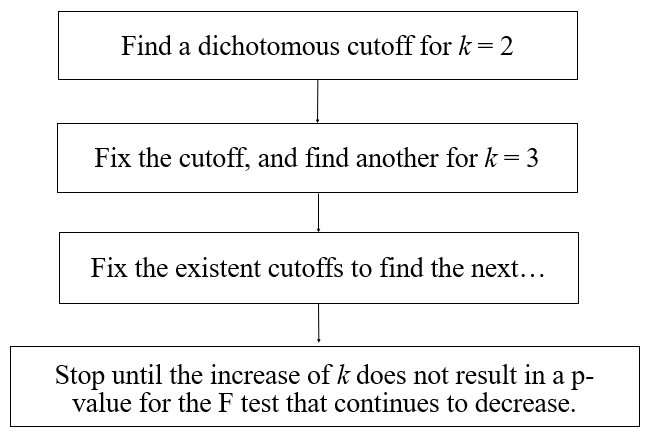
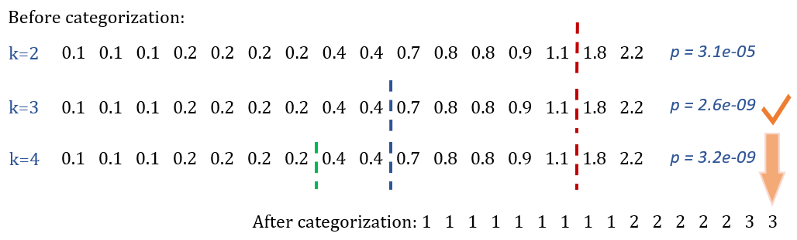
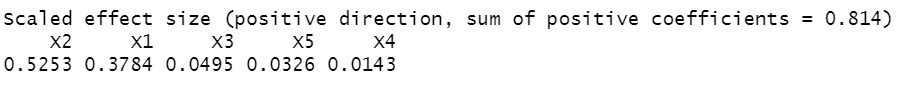
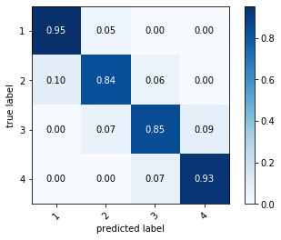
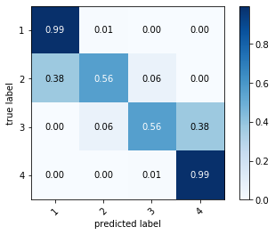

# Adaptive-mixture-categorization (AMC)-based g-computation
Adaptive-mixture-categorization (AMC)-based g-computation approach combines g-computation with an optimal categorization search using the F statistic. It reduces variance within each category and retains the variance between categories to build more powerful predictors for mixture analysis. 

## Install
R package 'amc' can be installed from Github using the command:

``` r
# install.packages("devtools")
devtools::install_github("sitingLi/amc")
```

## Main function

``` r
amc(data)
```
This function is for categorizing variables into the optimal number of categories. For the input data, the number of categories for different variables (columns) can be different.

**Input**
- data: the input data is in the form of a data frame

**Output**
- output: the categorized data
- group: the number of categories for each variable
- cutoff: the thresholds/cutoffs of the categorization for each variable

``` r
amc.fixed.k(data, group, min_num)
```
This function is for categorizing variables into specified number of categories (k). The number of categories for different variables (columns) is the same.

**Input**
- data: the input data for categorization
- group: the number of categories, which can be set as an integer from 2 to 10 by the user. (default = 2) We recommend the number is less than 6.
- min_num: the minimum sample size of each category, which can be set as a positive integer. (default = 1) We recommend the number is larger than 5 percent of the overall sample size.

**Output**
- output: the categorized data
- cutoff: the thresholds/cutoffs of the categorization for each variable


## Steps of AMC
Assume k is the number of categories:




## Examples
### 1. A toy example of categorization

We are going to categorize a variable with 16 values (0.1, 0.1, 0.1, 0.2, 0.2, 0.2, 0.2, 0.4, 0.4, 0.7, 0.8, 0.8, 0.9, 1.1, 1.8, 2.2).

``` r
library(amc)
toy_data <- data.frame(c(0.1, 0.1, 0.1, 0.2, 0.2, 0.2, 0.2, 0.4, 0.4, 0.7, 0.8, 0.8, 0.9, 1.1, 1.8, 2.2))
result = amc(toy_data)
output <- result[["output"]]
cutoff <- result[["cutoff"]]
group <- result[["group"]]
cat("The function categorizes this variable into", group, "categories.", "The cutoffs are:", cutoff)
```

The categorization process is as follows:



The first cutoff is between 1.1 and 1.8 given by the largest F value/ smallest p value. The second cutoff is between 0.4 and 0.7. The p-value of F-test decreases when increasing k from 2 to 3, but it increases after increasing k to 4, so AMC divides this variable into 3 categories.

### 2. Estimating mixture effect

Generating a simulated data (n = 1000) with 5 variables X1 - X5, for each variable:
- Observed values have a probability of 40% to be sampled from *N(1, 0.5^2)*
- Observed values have a probability of 30% to be sampled from *N(2, 0.5^2)*
- Observed values have a probability of 20% to be sampled from *N(3, 0.5^2)*
- Observed values have a probability of 10% to be sampled from *N(4, 0.5^2)*

The outcome Y is generated by Y = 0.4X1 + 0.6X2 + ℇ, where ℇ ∼ *N(0,1)*. Overall mixture effect is 0.4 + 0.6 = 1


``` r
# generate the simulated data
library(amc)
set.seed(1)
data <- sim(size = 1000, nvariate = 5, prob = c(0.4, 0.3, 0.2, 0.1), mu = c(1, 2, 3, 4), sigma = c(1/2, 1/2, 1/2, 1/2), betay = c(0.4, 0.6))
input <- data[[2]][,-1]
# use ‘amc’ package to categorize the data
result <- amc.fixed.k(input, group = 4)
output <- cbind(data[[2]][,1], result$output)
colnames(output)[1] <- "y"
# use ‘qgcomp’[1] package to estimate mixture effect
# Reference: Keil, Alexander P., et al. "A quantile-based g-computation approach to addressing the effects of exposure mixtures." Environmental health perspectives 128.4 (2020): 047004.
library(qgcomp)
(estimate.model = qgcomp.noboot(y~., data=output, family="gaussian", q = NULL))
```

Result:



The estimated overall mixture effect is 0.814.

### 3. Categorization accuracy of a simulated example

``` r
# generating simulated data
input <- data.frame(matrix(ncol = 10, nrow = 1000))
ground_truth <- data.frame(matrix(ncol = 10, nrow = 1000))
set.seed(123)
for(j in 1:10){
  a0 = rnorm(100, mean = 3, sd=1)
  a1 = rnorm(400, mean = 6, sd=1)
  a2 = rnorm(400, mean = 9, sd=1)
  a3 = rnorm(100, mean = 12, sd=1)
  input[,j] = c(a0, a1, a2, a3)
  b0 = rep(1,100)
  b1 = rep(2,400)
  b2 = rep(3,400)
  b3 = rep(4,100)
  ground_truth[,j] = c(b0, b1, b2, b3)
}

# using amc function to categorize
library(amc)
result = amc(input)
output = result$output

# quantile categorization
output_quantile <- input
for (i in 1:dim(input)[2]){
  data_temp = sort(input[,i])
  threshold1 = data_temp[250]
  threshold2 = data_temp[500]
  threshold3 = data_temp[750]
  output_quantile[,i] <- cut(input[,i], breaks = c(-Inf, sort(c(threshold1, threshold2, threshold3)), Inf),labels = c(1,2,3,4))
}

# creating confusion matrix
# install.packages("caret")
library(caret)
predicted_value <- factor(c(t(output)))
predicted_value_quantile <- factor(c(t(output_quantile)))
expected_value <- factor(c(t(ground_truth)))
confusionMatrix(data = predicted_value, reference = expected_value)
confusionMatrix(data = predicted_value_quantile, reference = expected_value)
```

**Using amc() to categorize the variable:**
- Accuracy: 0.8628
- Kappa : 0.7978
- Confusion matrix:


**Categorizing variables into quartiles:**
- Accuracy: 0.647
- Kappa : 0.5293
- Confusion matrix:

